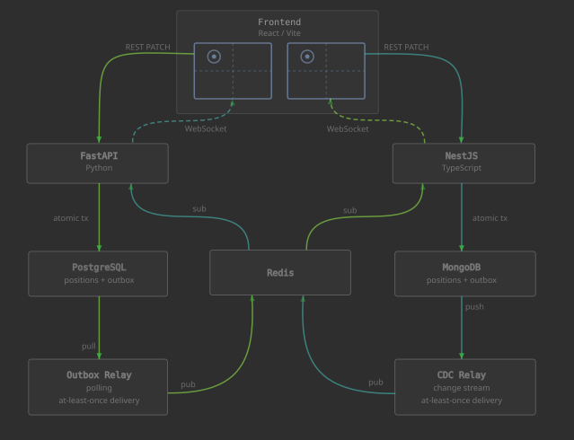

# CLAUDE.md

This file provides guidance to Claude Code (claude.ai/code) when working with code in this repository.

## Infrastructure

Start Postgres, Redis, and MongoDB (as a single-node replica set) before running any service:
```bash
docker compose up -d
```
PostgreSQL credentials: user `app`, password `app`, database `app`, all on localhost defaults.
MongoDB: unauthenticated, `mongodb://localhost:27017/app?replicaSet=rs0`. The `mongo-init` container runs `rs.initiate()` automatically on first start.

## Development

Run all three services together from the repo root:
```bash
pnpm dev
```

Or individually:
```bash
pnpm dev:frontend       # Vite dev server — http://localhost:5173
pnpm dev:backend-ts     # NestJS watch mode — http://localhost:3001
pnpm dev:backend-py     # FastAPI reload — http://localhost:8000
```

### NestJS (apps/backend-ts)
```bash
pnpm --filter backend-ts build       # compile
pnpm --filter backend-ts lint        # eslint --fix
pnpm --filter backend-ts test        # jest
pnpm --filter backend-ts test:e2e    # jest e2e
```

### FastAPI (apps/backend-py)
The Python service uses a local venv managed by `uv`. Always prefix Python/pip commands with `.venv/bin/`:
```bash
cd apps/backend-py
uv sync --no-install-project        # restore venv from uv.lock (use this after a fresh clone or if packages go missing)
uv pip install <package>             # install a dependency (then run `uv lock` to update uv.lock)
.venv/bin/python -c "import main"    # syntax-check main.py
```
`--no-install-project` is required because the service is a single `main.py` script, not an installable package, so `uv sync` would otherwise fail trying to build it.
No test runner is configured yet.

### Frontend (apps/frontend)
```bash
pnpm --filter frontend build   # tsc + vite build
pnpm --filter frontend lint    # eslint
```

## Architecture

This is a polyglot monorepo (pnpm workspaces) demonstrating real-time synchronization across two independent backends that each own a separate database and replicate via Redis pub/sub.



**Separate storage per node:** NestJS uses MongoDB (`positions` collection); FastAPI uses PostgreSQL (`positions` table). Each backend only ever touches its own storage. `data_id` is an internal constant (`"1"`); it is not exposed as a URL parameter.

**Outbox pattern:** every write atomically inserts both a position record and an outbox record in the same DB transaction. A relay process reads the outbox and publishes to the Redis channel `position:replicated`. NestJS uses a MongoDB change stream relay (CDC, push-based); FastAPI uses a polling relay (100ms interval). This guarantees at-least-once delivery even if the process crashes between the DB write and the publish.

**Replication loop prevention:** each backend's subscriber ignores events where `source` matches itself (`'ts'` for NestJS, `'py'` for FastAPI). `applyReplication()` writes the position but does not insert to the outbox.

**NestJS WS:** `PositionGateway` is a plain `@Injectable()` (not a `@WebSocketGateway`) that owns a `ws.Server({ noServer: true })`. `main.ts` wires it to the HTTP server's `upgrade` event at path `/ws`. This avoids the `WsAdapter` abstraction.

**FastAPI WS:** a background asyncio task subscribes to Redis and broadcasts to all connected WebSocket clients stored in a module-level `set`.

**Frontend:** a single `PositionBox` component is instantiated twice with different `restUrl`/`wsUrl` props. Position starts as `null` and is loaded via GET on mount. During drag, WS updates are suppressed via a `dragging` ref to avoid jitter from self-echo.

## Logging

Both backends emit HTTP access logs to stdout in a unified format:
```
INFO METHOD /path STATUS_CODE Nms
```
`/metrics` requests are excluded from logs in both backends. NestJS uses `console.log` directly (no NestJS `Logger` wrapper). FastAPI disables `uvicorn.access` and uses a custom Starlette middleware.

## Kubernetes (minikube)

Images are built directly into minikube's docker daemon — no registry needed. All resources live in the `edu-oe` namespace.

```bash
make build          # eval $(minikube docker-env) + docker build for all three images
make deploy         # kubectl apply namespace first, then all k8s/ manifests
make teardown       # kubectl delete -f k8s/
```

After changing code, rebuild the image and rollout restart the affected deployment(s) — `kubectl apply` alone won't redeploy because the `:latest` tag and spec don't change.

**Gotchas:**
- `make deploy` applies `k8s/namespace.yaml` explicitly before `k8s/` to avoid ordering failures (`kubectl apply -f k8s/` is alphabetical — backend manifests come before namespace).
- `imagePullPolicy: Never` on all app deployments — images must exist in minikube's daemon.
- `pnpm deploy --legacy` is required in the NestJS Dockerfile (pnpm v10 changed the default).
- Frontend hardcodes `localhost:3001` and `localhost:8000` — this works because `minikube tunnel` maps the LoadBalancer services to those ports. Cloud deployment would need `VITE_*` env vars baked in at build time.

**k8s manifest layout:**
- `k8s/namespace.yaml` — `edu-oe` namespace
- `k8s/postgres.yaml` — Secret + PVC (1Gi) + Deployment + ClusterIP :5432
- `k8s/redis.yaml` — Deployment + ClusterIP :6379
- `k8s/mongo.yaml` — PVC (2Gi) + StatefulSet (single-node replica set `rs0`) + headless Service :27017
- `k8s/mongo-init-job.yaml` — one-shot Job that runs `rs.initiate()` after the StatefulSet is ready
- `k8s/backend-ts.yaml` — ConfigMap (`MONGODB_URI`, Redis config) + Deployment + LoadBalancer :3001
- `k8s/backend-py.yaml` — ConfigMap + Deployment + LoadBalancer :8000
- `k8s/frontend.yaml` — Deployment + LoadBalancer :80
- `k8s/monitoring.yaml` — ServiceMonitor x2 (scrapes `/metrics` on both backends every 15s)
- `k8s/grafana-dashboard.yaml` — ConfigMap auto-imported by Grafana sidecar; label `grafana_dashboard: "1"`

Credentials: `postgres-secret` holds `POSTGRES_USER/PASSWORD/DB`; FastAPI's backend deployment pulls from that secret. NestJS connects to MongoDB without credentials (`MONGODB_URI` in its ConfigMap). The replica set member host in the K8s URI must be the StatefulSet pod FQDN (`mongo-0.mongo.edu-oe.svc.cluster.local:27017`), not `localhost`, so the driver resolves it correctly from within the cluster.

## Observability (Prometheus + Grafana + Loki)

Deployed into a separate `monitoring` namespace via Helm.

```bash
make observe          # add Helm repos, install kube-prometheus-stack + loki + alloy, apply ServiceMonitors + dashboard + datasource
make observe-teardown # uninstall Helm releases + delete monitoring k8s resources
```

Helm values live in `k8s/helm/`.

**Metrics exposed:**
- Both backends expose `GET /metrics` (Prometheus text format)
- NestJS: `http_requests_total`, `http_request_duration_seconds`, `ws_connections_active`, `redis_messages_published_total`, `redis_messages_received_total`
- FastAPI: same custom metrics via `prometheus_client`, plus automatic HTTP instrumentation from `prometheus-fastapi-instrumentator`

**Gotchas:**
- `serviceMonitorNamespaceSelector: {}` in kube-prometheus-stack values is required — the default restricts Prometheus to its own namespace and won't find ServiceMonitors in `edu-oe`.
- Grafana sidecar `searchNamespace: ALL` is required to pick up the dashboard ConfigMap from the `edu-oe` namespace.
- NestJS uses a local `Registry()` instance (not the global default) to avoid "metric already registered" errors during `--watch` hot-reloads.
- FastAPI uses the global `prometheus_client` registry — do not create a `Registry()` there or the instrumentator's metrics will be hidden from `/metrics`.
- `make observe` uses `--wait` on the kube-prometheus-stack install so the `ServiceMonitor` CRD exists before `kubectl apply -f k8s/monitoring.yaml` runs.
- ServiceMonitors must have label `release: kube-prometheus-stack` — the chart hardwires `serviceMonitorSelector: {matchLabels: {release: kube-prometheus-stack}}` and ignores the `{}` override in values.
- `grafana/loki-stack` (Loki 2.6.1) is incompatible with modern Grafana — `/loki/api/v1/format_query` was added in 2.7 and the datasource health check always fails. Use `grafana/loki` chart (SingleBinary mode, Loki 3.x) instead.
- The Loki datasource is provisioned automatically via `k8s/loki-datasource.yaml` (label `grafana_datasource: "1"` triggers the Grafana sidecar).
- Use `grafana/alloy` (not the deprecated `grafana/promtail`) for log collection. Alloy is the successor to Promtail and Grafana Agent. Config is in River/Alloy syntax inside `alloy.configMap.content` in `k8s/helm/alloy-values.yaml`.

## Key files
- `apps/backend-ts/src/position/position.schema.ts` — Mongoose Position schema (`positions` collection)
- `apps/backend-ts/src/position/outbox.schema.ts` — Mongoose Outbox schema (`outbox` collection)
- `apps/backend-ts/src/position/position.service.ts` — upsert via MongoDB session transaction (position + outbox atomic write)
- `apps/backend-ts/src/position/outbox-relay.service.ts` — change stream relay: watches `outbox` collection, publishes to Redis, deletes on success; catch-up scan on startup
- `apps/backend-ts/src/position/position.gateway.ts` — WS broadcast + Redis subscriber (replication sink); handles partition state transitions
- `apps/backend-ts/src/app.module.ts` — MongooseModule + ConfigModule setup
- `apps/backend-ts/src/redis.provider.ts` — shared ioredis client token `REDIS_CLIENT`
- `apps/backend-ts/src/metrics/` — MetricsService (Registry + counters/gauges), middleware, controller, global module
- `apps/backend-py/main.py` — entire FastAPI service (single file): models, outbox_publisher polling relay, redis_subscriber, all endpoints
- `apps/frontend/src/App.tsx` — frontend shell (routing, theme, layout)
- `apps/frontend/src/components/PositionBox.tsx` — draggable marker component; REST write + WS receive
- `apps/frontend/src/context/PartitionContext.tsx` — partition state machine; heal logic; auto-heal on Redis reconnect
- `k8s/helm/` — Helm values for kube-prometheus-stack, loki, and alloy
